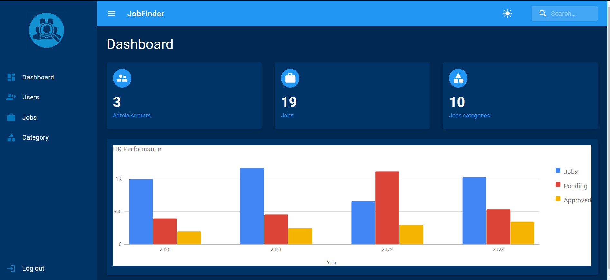
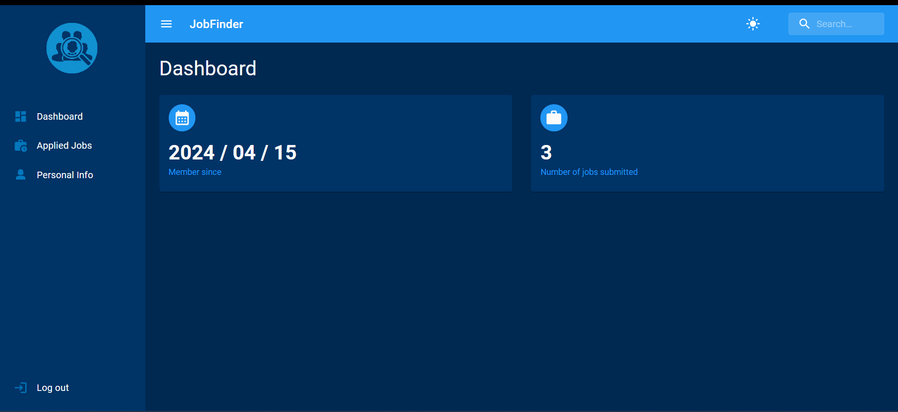

## TITRE DE L'APPLICATION
JOB FINDER

## DESCRIPTION
Une application web qui aide les utilisateurs à trouver des offres d'emploi correspondant à leurs compétences et à leurs intérêts. L'application offre une interface conviviale et des fonctionnalités avancées pour faciliter la recherche d'emploi.

## FONCTIONNALITES PRINCIPALES
- Recherche d'offres d'emploi par mots-clés, emplacement ou catégorie.
- Filtres avancés pour affiner les résultats de recherche.
- Affichage des détails de chaque offre d'emploi, y compris la description, les compétences requises et les informations sur l'entreprise.
- Possibilité de créer un profil utilisateur avec un CV et des préférences de recherche.
- Alertes d'emploi personnalisées pour informer les utilisateurs des nouvelles offres correspondant à leurs critères.
- Possibilité de postuler directement depuis l'application ou de sauvegarder des offres pour une consultation ultérieure.

## COMMENT CA MARCHE ?
Après le lancement de l'application, vous serez dirigé vers la page d'accueil. Veuillez vous connecter en tant qu'administrateur ou utilisateur en suivant ces étapes :

1. Cliquez sur l'avatar utilisateur situé en haut à droite de l'écran.
2. Ensuite, cliquez sur le bouton "Login".

Vous pouvez vous connecter en tant qu'administrateur en utilisant les identifiants suivants :
- Email: administrateur@gmail.com
- Mot de passe: administrateur

Alternativement, vous pouvez vous connecter en tant qu'utilisateur en utilisant les identifiants suivants :
- Email: user1@gmail.com
- Mot de passe: userpassword1

### PAGE D'ACCUEIL

### PAGE ADMINISTRATEUR

### PAGE UTILISATEUR

## Technologies utilisées

**Backend:**
- Framework: Express.js
- Langages: JavaScript (version non spécifiée)
- Base de données: MongoDB
- Outils de développement:
  - bcryptjs: 2.4.3
  - body-parser: 1.20.1
  - cookie-parser: 1.4.6
  - cors: 2.8.5
  - dotenv: 16.0.3
  - express: 4.18.2
  - jsonwebtoken: 9.0.0
  - mongoose: 5.13.9
  - morgan: 1.10.0
  - nodemon: 3.1.0

**Frontend:**
- Framework: React.js
- Langages: JavaScript (version non spécifiée)
- Outils de développement:
  - @emotion/react: 11.10.6
  - @emotion/styled: 11.10.6
  - @mui/icons-material: 5.11.9
  - @mui/material: 5.11.10
  - @mui/x-data-grid: 6.0.2
  - axios: 1.1.3
  - formik: 2.2.9
  - moment: 2.29.4
  - react: 18.2.0
  - react-dom: 18.2.0
  - react-google-charts: 4.0.0
  - react-pro-sidebar: 1.0.0
  - react-redux: 8.0.5
  - react-router-dom: 6.8.1
  - react-scripts: 5.0.1
  - react-toastify: 9.1.1
  - redux: 4.2.1
  - redux-thunk: 2.4.2
  - yup: 1.0.0

## Installation
1. Clonez ce dépôt : git clone [lien du dépôt]
2. Installez les dépendances : npm install
3. Configurez les variables d'environnement.
4. Lancez l'application : npm start

## Configuration
Environnement requis : [Liste des dépendances logicielles requises]

Variables d'environnement :
- API_KEY : Clé d'API nécessaire pour accéder aux données d'emploi.
- DATABASE_URL : URL de connexion à la base de données.

## Documentation
Pour obtenir une documentation détaillée de l'API ou du fonctionnement interne de l'application, veuillez consulter [lien vers la documentation].

## Contributions
Les contributions sont les bienvenues ! Si vous souhaitez contribuer à ce projet, veuillez suivre les étapes suivantes :
1. Forkez le dépôt
2. Créez une branche pour votre fonctionnalité : git checkout -b nom-de-la-fonctionnalité
3. Effectuez les modifications nécessaires.
4. Faites un commit de vos modifications : git commit -m "Description des modifications"
5. Poussez vos modifications sur votre dépôt : git push origin nom-de-la-fonctionnalité
6. Ouvrez une demande d'extraction sur la branche principale du projet.

## Auteurs
- [Votre nom]
- [Autre contributeur 1]
- [Autre contributeur 2]

## Licence
Ce projet est sous licence [insérez la licence appropriée].

N'hésitez pas à personnaliser ce modèle README en fonction des besoins spécifiques de votre application web "Get a Job". Assurez-vous de fournir des informations claires et concises pour faciliter la compréhension et l'utilisation de votre application par les utilisateurs et les développeurs.